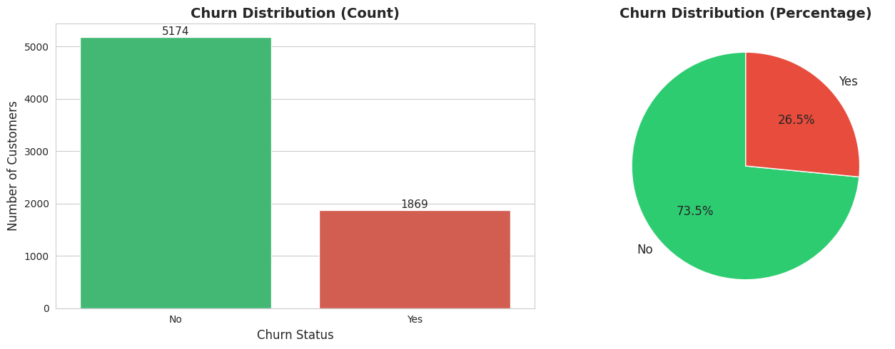
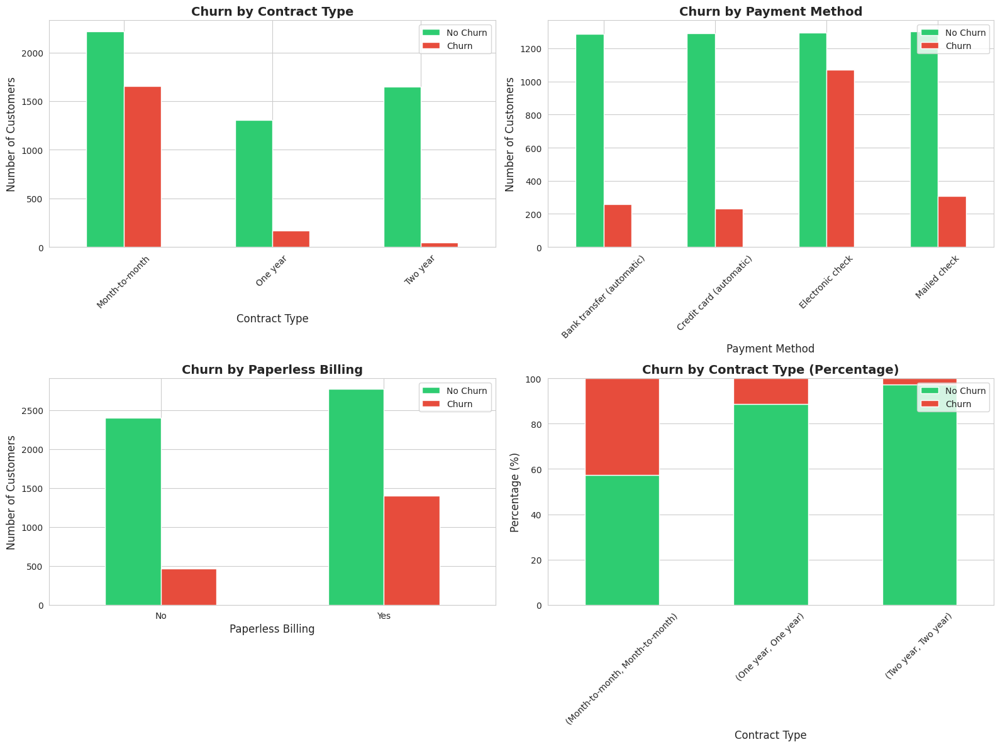
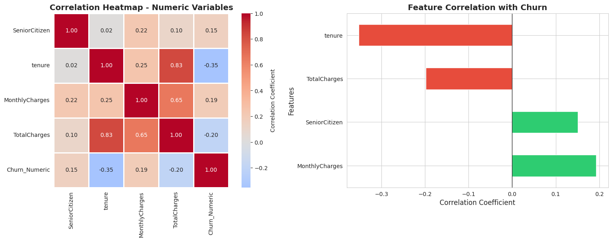

# Telco Customer Churn Analysis & Retention Strategy

## 📊 Project Overview

This project presents a comprehensive analysis of customer churn patterns in the telecommunications industry. Using a dataset of 7,043 customers, I performed end-to-end data analysis—from data cleaning and exploratory analysis to SQL queries and interactive dashboard creation—to identify key factors contributing to customer attrition and provide actionable insights for retention strategies.

## 🎯 Business Problem

Customer churn is a critical challenge in the telecom industry, directly impacting revenue and growth. This project aims to:
- Understand the key drivers of customer churn
- Identify high-risk customer segments
- Provide data-driven recommendations for retention strategies
- Quantify the financial impact of churn

## 🔑 Key Findings

- **Overall Churn Rate:** 26.54% (1,869 out of 7,043 customers)
- **High-Risk Segments:**
  - Month-to-month contracts: 42.7% churn rate
  - Electronic check payment users: 45.3% churn rate
  - Fiber optic internet users: 41.9% churn rate
- **Financial Impact:** Churned customers contribute significantly less lifetime value despite having higher monthly charges ($74 vs $61)
- **Tenure Insight:** Churned customers stay on average 18 months vs 38 months for retained customers

## 🛠️ Tools & Technologies

- **Python:** pandas, numpy, matplotlib, seaborn
- **SQL:** PostgreSQL (21 analytical queries)
- **Visualization:** Power BI (2-page interactive dashboard)
- **Environment:** Google Colab, pgAdmin 4

## 📁 Project Structure
```
Telco-Customer-Churn-Analysis/
│
├── images/                               # Dashboard and analysis visualizations
├── telco_customer_churn.csv              # Original dataset (7,043 rows, 21 columns)
├── telco_customer_churn_cleaned.csv      # Cleaned dataset
├── telco_churn_data_cleaning.ipynb       # Data cleaning & quality checks
├── telco_churn_eda.ipynb                 # Exploratory data analysis
├── telco_churn_analysis.sql              # PostgreSQL queries (21 analyses)
├── telco_churn_dashboard.pbix            # Power BI dashboard
└── README.md                             # Project documentation
```

## 📈 Analysis Workflow

### 1. Data Cleaning (Python)
- Identified and resolved data quality issues:
  - Converted `TotalCharges` from text to numeric
  - Handled 11 records with blank values (new customers with 0 tenure)
  - Validated data consistency across all 21 columns
- **Result:** 100% clean data with 0 missing values

### 2. Exploratory Data Analysis (Python)

Performed comprehensive analysis across six key areas:

**Demographic Analysis:**
- Senior citizens show 41% higher churn rate
- Customers without partners: 33% churn vs 20% with partners



**Service Usage:**
- Fiber optic users: 42% churn (highest among internet services)
- Customers without tech support: 42% churn vs 15% with support



**Contract & Payment:**
- Month-to-month contracts: 43% churn vs 3% for two-year contracts
- Electronic check payments: 45% churn (highest risk)

**Financial Analysis:**
- Churned customers pay $13/month MORE on average
- Average tenure: 18 months (churned) vs 38 months (retained)


**Correlation Analysis:**
- Strong negative correlation between tenure and churn (-0.35)
- Positive correlation between monthly charges and churn (+0.19)



### 3. SQL Analysis (PostgreSQL)
Created 21 SQL queries covering:
- Churn distribution and rates
- Demographic breakdowns
- Service usage patterns
- Contract and payment analysis
- Financial metrics and customer lifetime value
- Advanced business insights (high-risk profiles, revenue impact)

### 4. Data Visualization (Power BI)

**Executive Summary Page:**
- 4 KPI cards: Total Customers, Churn Rate, Churned/Retained counts
- Churn distribution pie chart
- Churn by contract type, internet service, and payment method


**Demographics Page:**
- Churn by gender, partner status, and dependents
- Customer distribution by tenure (histogram)


## 💡 Business Recommendations

1. **Contract Strategy:**
   - Incentivize two-year contracts (97% retention rate)
   - Offer month-to-month to annual contract migration promotions

2. **Payment Method:**
   - Encourage automatic payment methods
   - Address pain points with electronic check users

3. **Service Improvements:**
   - Investigate fiber optic service quality issues
   - Bundle tech support and online security with high-value plans

4. **Early Intervention:**
   - Focus retention efforts on customers in first 12 months
   - Target customers without partners/dependents with engagement programs

## 📊 Interactive Dashboards

The Power BI dashboard provides interactive visualizations with drill-down capabilities for deeper analysis. Download the `.pbix` file to explore:
- Executive summary with key metrics
- Demographic analysis
- Service usage patterns
- Contract and payment insights
- Interactive filters and cross-filtering

## 📫 Contact

**Onur Aydındağ**
- LinkedIn: [linkedin.com/in/onur-aydındağ](https://www.linkedin.com/in/onur-ayd%C4%B1nda%C4%9F-aa528a216/)
- GitHub: [github.com/OnurAydindag](https://github.com/OnurAydindag)

---

*This project was created as part of my Data Analyst portfolio to demonstrate end-to-end analytical capabilities.*
